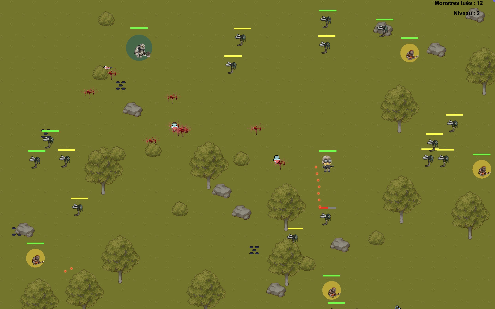

# **404 - Survival Not Found** 🎮

## **Description**
A 2D Java game where players control a hero fighting monsters to survive. The game features exploration, dynamic combat, and an immersive atmosphere.

---

## **Main Features**
- **Hero and Monsters**:
    - Control a hero with unique abilities.
    - Diverse enemies.
- **Dynamic Map**:
    - Obstacles like trees, bush and spikes.
- **Gameplay**:
    - Health and speed systems.
    - Increasing difficulty levels.
- **2D Graphics**:
    - Pixel art style.
    - Simple and intuitive interface.

---

## **Technologies Used**
- **Language**: Java.
- **Libraries**:
    - Swing.
    - AWT.
- **IDE**: IntelliJ IDEA.
- **Additional Tools**:
    - Version control with Git.

---

## **Installation**
### Prerequisites:
- **Java 17** or higher.
- An IDE capable of running Java projects.

### Steps:
1. Clone the repository:
   ```bash
   git clone git@github.com:EpitechMscProPromo2027/T-JAV-501-STG_10.git
    ```
2.	Open the project in your IDE.
3.	Run the main file: **Main.java**.

---

## **How to Play**

1.	Launch the game via the executable or your IDE.
2.	Use the following controls to play:
- **Arrow keys**: Move the hero.

3.	Survive as long as possible against the monsters!

---

## Project Structure

Main Directories:

- src/: Contains all source code.
    - item/: Classes for the decoration like, Trees, rock etc.
    - main/: Main class, GamePanel etc.
    - player/: Classes for Hero, monsters etc.
    - weapon/: Classes for weapons like speed rifle, assault rifle etc.
- res/: Graphics.
    - hero/: Images for hero.
    - monster/: Images for monster.

---

## Screenshots

### Hero in Action


---

## Contributors

- **Loïc Le-Gal**
- **Dorian Bonneau**
- **Thomas Blachowiak**
